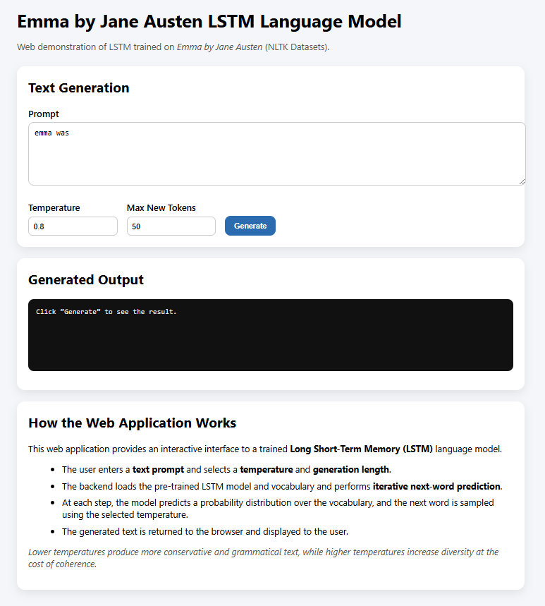

# Language Model Using LSTM – Emma (Jane Austen)

This assignment implements a word-level Long Short-Term Memory (LSTM) language model trained on Emma by Jane Austen (NLTK Datasets). According to the assingment this work divided into 3 main task. Data Aquisition, Model Training and Evaluation, Web base demonstration.

---
### Dataset

## **Task 1**: Dataset Acquisition and Preparation

* **Title**: Emma

* **Author**: Jane Austen

* **Source** : Project Gutenberg, accessed via the NLTK Gutenberg corpus

The dataset consists of the full text of the novel *Emma*. Long-form text-rich is well suited for language modeling due to its rich grammar and consistent narrative style.

### Data Splitting

The text is split into paragraphs and divided into:

* **80%** Training
* **10%** Validation
* **10%** Test

Splitting at the paragraph level avoids data leakage and ensures that validation and test sets contain unseen text.

---
## **Task 2**: Language Model Training and Evaluation

### Tokenization

A custom regular-expression-based tokenizer is used instead of torchtext. The tokenizer:

* Converts text to lowercase
* Separates words and punctuation
* Preserves contractions
* This produces a clean sequence of word tokens for training.

### Vocabulary Construction

* The vocabulary is built from the training set only.

* Special tokens are included:
    * `<unk>` for unknown words
    * `<eos>` for end-of-sentence

* Rare words below a frequency threshold are mapped to `<unk>`.

### Model Architecture

The language model is a word-level LSTM implemented in PyTorch:
* Embedding layer for word representations
* Two-layer LSTM for modeling sequential dependencies
* Linear output layer to predict next-word probabilities

* Hyperparameters:
    * Embedding dimension: 1024
    * Hidden dimension: 1024
    * Number of LSTM layers: 2

### Training

* Loss function: Cross-entropy loss
* Optimizer: Adam
* Gradient clipping is applied for stability
* The best model is selected based on validation perplexity
* Evaluation Metric: Perplexity
* Perplexity measures how uncertain the model is when predicting the next word. Lower perplexity indicates better language modeling performance.

---
## **Task 3**: Web Demonstration

| Before Generate | After Generate |
|-----------------|----------------|
|  |   | 

### How to Run

From the project directory:

```bash
cd app
python app.py
```

Then Open:

```bash
http://127.0.0.1:5000
```


