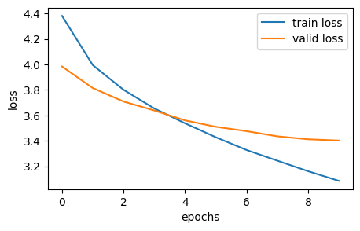
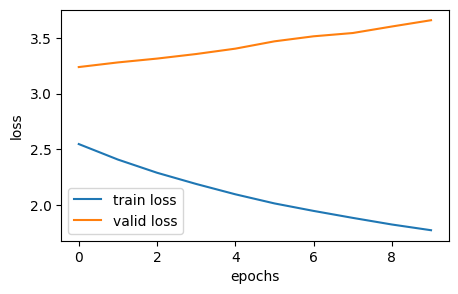
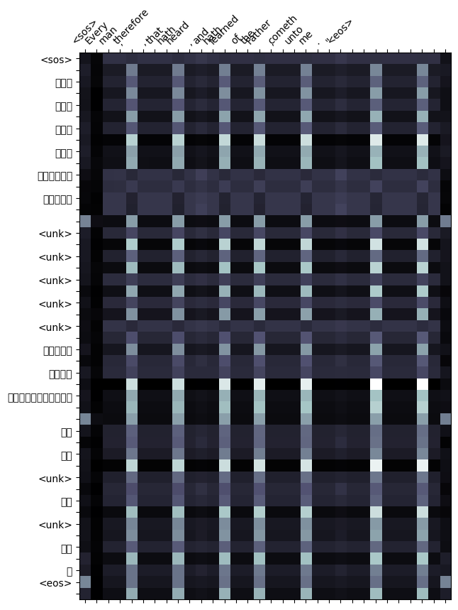
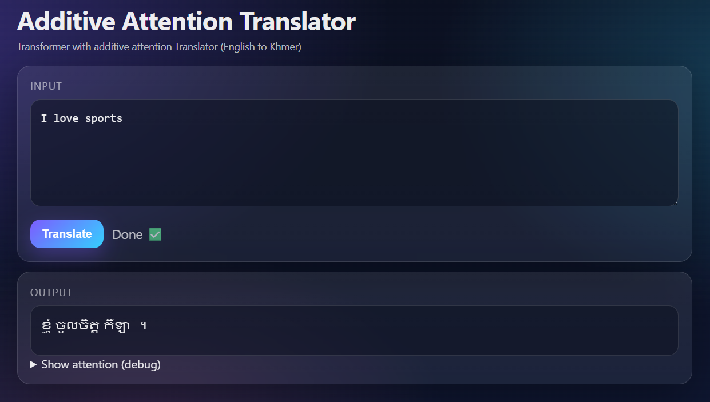

# A3 - Make Your Own Machine Translation Language (English to Khmer)

In this assignment I chose to create a machine translation for English to Khmer since it is my native language. In this assignment I will explore and comapre between two attention mechanism which are general attention and additive attention. The assignment deliver by implementing a web base application with the best performance attention mechanism for demonstration. 

---
## Dataset

Dataset information:

* **Source**: liboaccn/nmt-parallel-corpus (Huggingface)
* **Language Pair**: English to Khmer (EN-KM)
* **Dataset Size**: split by train (2.51M) I cut into 20000 rows for use in this assignment

---
## Text Processing

### **Normaliation**
The preprocessing pipeline applies tokenization but minimal explicit text normalization beyond whitespace trimming.

### **Tokenizationn**

Khmer text is normally written without spaces between words, so word boundaries are not explicit. In this assignment, I used khmer-nltk to perform Khmer word segmentation by automatically splitting Khmer sentences into word tokens using a dictionary/statistical segmentation approach.

1. whitespace normalization
2. tokenization using `khmernltk.word_tokenize` to split khmer sentence into khmer words token
3. Output list of tokens (words), which are then mapped to vocabulary IDs for the model.

**credit:** [VietHoang1512/khmer-nltk]https://github.com/VietHoang1512/khmer-nltk

## Model 
### **Attention Mechanism**

1. **General Attention**  
    $e_i = s^T h_i$
2. **Additive Attention**  
    $e_i = v_T tanh (W_1h_i + W_2s)$

**Ref:** [An Attentive Survey of Attention Models](https://arxiv.org/pdf/1904.02874.pdf)

---
## Evaluation and Verification

### 1. The performance comparison of the two models 

| Attentions         | Training Loss  | Training PPL  | Validation Loss | Validation PPL |
| :---               |     :---       |    :---       |       :---      |     :---:      |
| General Attention  |     3.085      |    58.035     |      3.402      |    53.724      |
| Additive attention |    0.773       |    6.874      |      12.775     |    3.658       |

### 2. Perfomance plot of the two models 
| General Attention | Additive Attention |
|-----------------|----------------|
|  |   | 

### 3. Attention map of the two models 

| General Attention | Additive Attention |
|-----------------|----------------|
|  |   |

### 4. Analysis: 
The additive attention mechanism effectively enhances neural machine translation by enabling dynamic alignment between source and target sequences. The observed improvements in training and validation metrics demonstrate that additive attention supports accurate translation between native language and English by handling structural differences, maintaining contextual information, and learning flexible word associations. Therefore additive attention are being used for the web app demonstration. 

## Web Application

