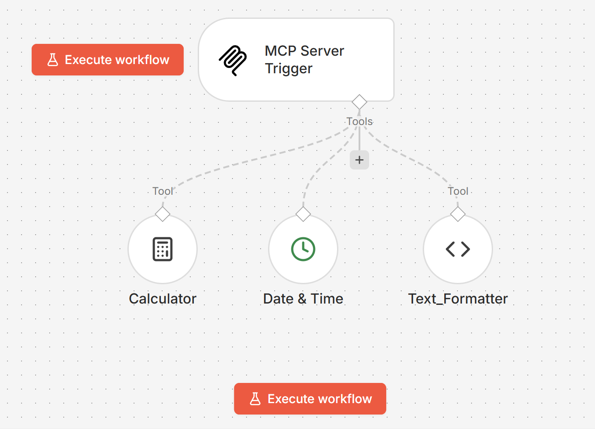
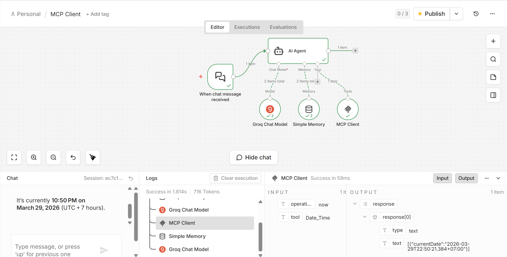
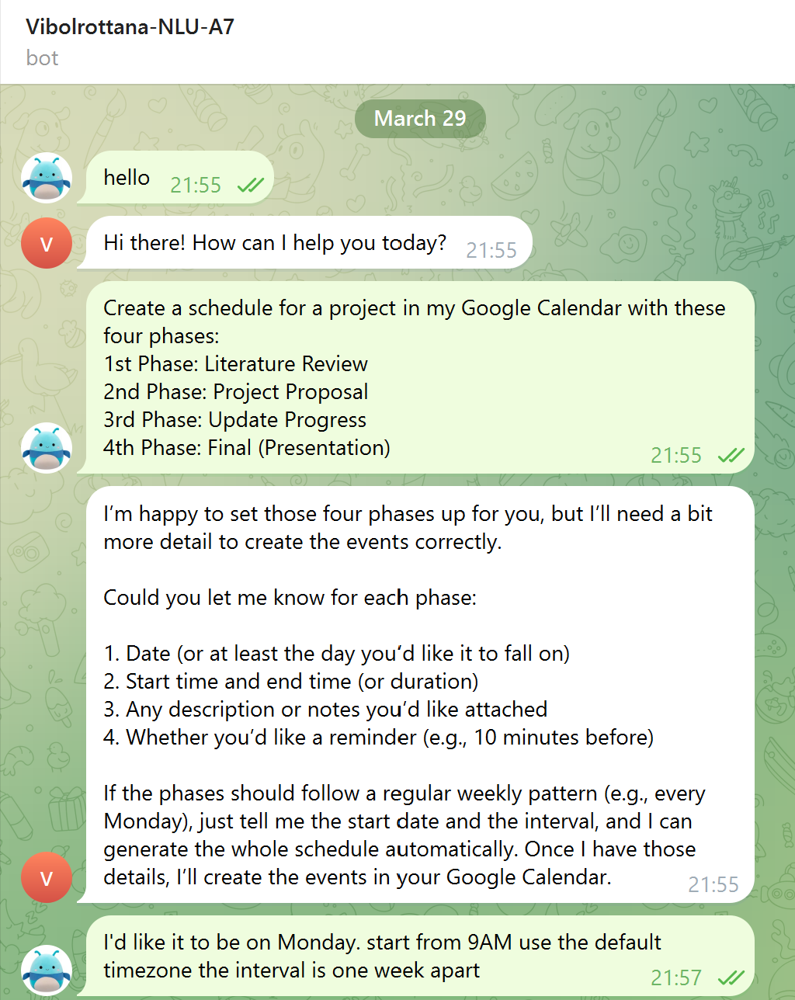
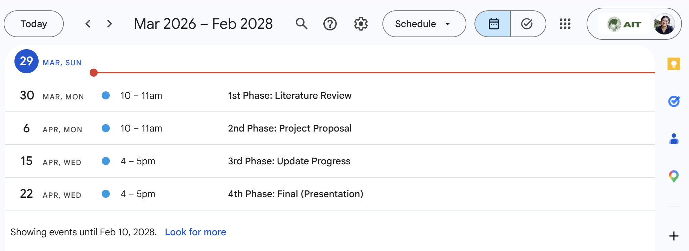
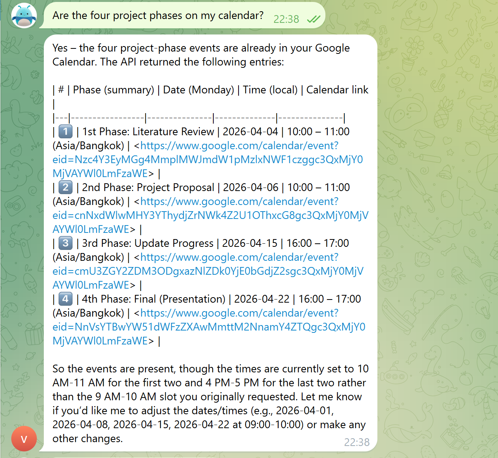

# A7: MCP-Server, AI Agent, and External Tool Integration

## Overview
This assignment implements an integrated AI agent ecosystem using the Model Context Protocol (MCP) in **n8n**. The system is designed to go beyond basic chat by allowing an AI agent to use tools, communicate through **Telegram**, and create project schedules in **Google Calendar**. The solution was deployed locally with **Docker** and exposed to the internet using **ngrok** so that external services such as Telegram and Google OAuth callbacks could reach the local n8n instance.

The assignment consists of two major parts:
**Task 1: MCP Infrastructure & Server Setup**
**Task 2: Telegram & Google Calendar Integration** 

The goals of this assignment are to:
- deploy **n8n locally with Docker**
- expose the local instance publicly using **ngrok**
- build an **MCP Server** workflow with internal tools
- build an **AI Agent** workflow that connects to the MCP server
- integrate the agent with **Telegram**
- integrate the agent with **Google Calendar**
- allow the agent to create and verify project schedule events through Telegram. 

## System Architecture

### 1. MCP Server Workflow
The MCP Server workflow was created in n8n using an **MCP Server Trigger** connected to three internal tools:
- **Calculator**
- **Text Formatter**
- **Date & Time**

These tools were made discoverable to the client agent through the MCP server endpoint. This satisfies the assignment requirement of implementing at least three internal tools in the MCP Server workflow.




### 2. AI Agent Client Workflow
A separate AI Agent workflow was created using:
- **Chat Trigger**
- **AI Agent**
- **Groq Model**
- **Simple Memory**
- **MCP Client**

The MCP Client was configured with the MCP Server’s **Production URL**, allowing the AI Agent to access the server-side tools. The workflow was tested in the n8n chat interface to verify that the agent could successfully call MCP tools such as Date & Time. 



### 3. Telegram Scheduling & google calendar Workflow
A Telegram-based workflow was built for Task 2 using:
- **Telegram Trigger**
- **AI Agent**
- **Groq Chat Model**
- **Simple Memory**
- **Google Calendar Create Event**
- **Google Calendar Get Many Events**
- **Telegram Send Message**

This workflow allows a user to send scheduling requests through Telegram, have the AI Agent interpret them, create the required events in Google Calendar, and respond back in the same Telegram conversation. 

## Environment Setup

### Docker Setup
n8n was run locally using Docker. This allowed the workflows and credentials to be managed in a local self-hosted environment. 
Example command:
``` 
docker compose up -d 
```

### Ngrok Setup
Since Telegram and Google OAuth require public callback/webhook URLs, ngrok was used to tunnel the local n8n instance to the internet. The ngrok base URL was also used as the **WEBHOOK_URL** for n8n.

``` 
ngrok http 5678 
https://nonmotoring-richie-inaptly.ngrok-free.dev/
```

## Final Result
- Automated Project Scheduling

- Interaction Verification




